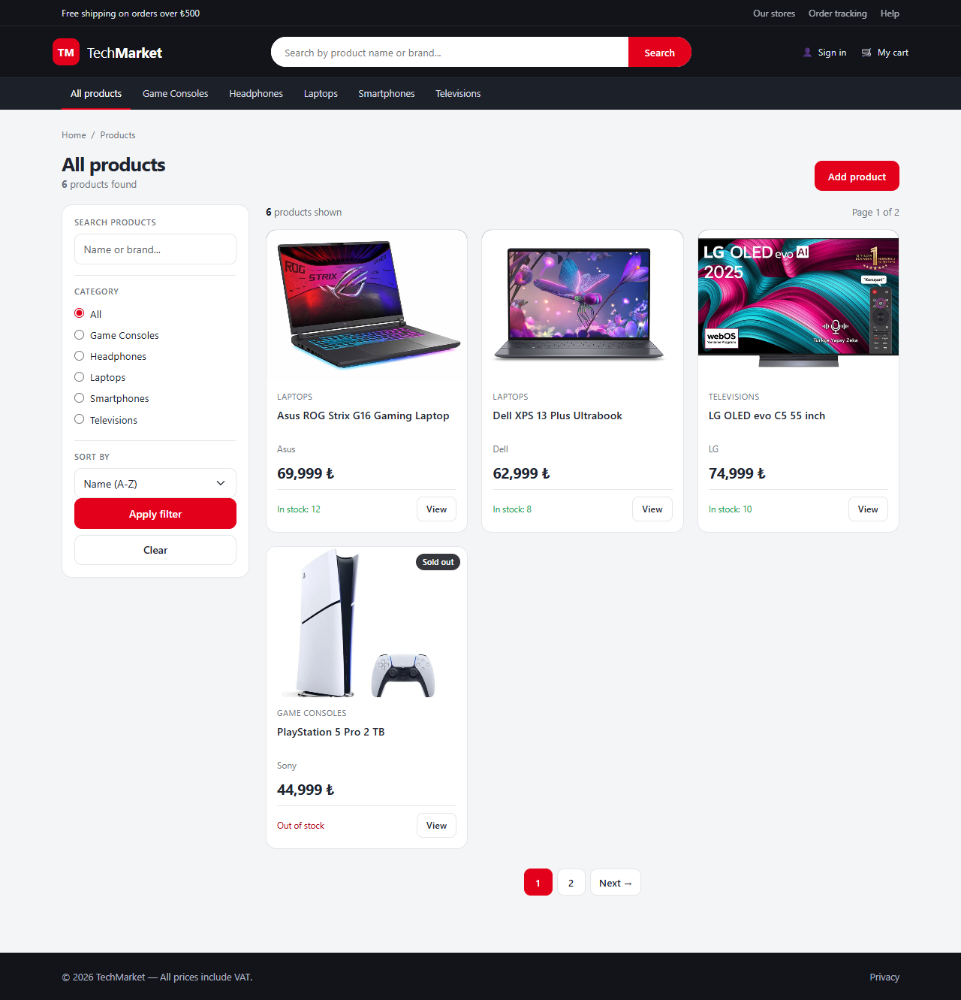
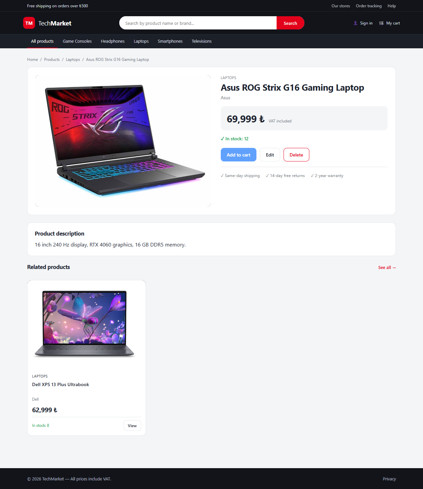

# TechMarket

An e-commerce storefront for tech products, built with **ASP.NET Core MVC (.NET 10)**.

This started as a way to learn .NET by building something real instead of following a
tutorial. It grew into a working product catalogue: browse, search, filter, create,
edit and delete products — with image upload, discount pricing and per-product
technical specifications.



## Features

**Storefront**

- Home page with a hero section and the newest arrivals
- Catalogue with case-insensitive search, category filter, four sort orders and paging
- Product detail page with discount highlighting, stock status and technical specifications
- Discounted and out-of-stock products are marked visually

**Product management**

- Create, edit and delete products
- Image upload with an extension whitelist, 2 MB size limit, GUID file names and cleanup of the replaced file
- Discount price with an automatically calculated discount percentage
- Add and remove technical specifications per product

## Tech stack

| | |
|---|---|
| Runtime | .NET 10 / ASP.NET Core MVC |
| Data access | Entity Framework Core 10 |
| Database | SQLite |
| UI | Bootstrap 5 with a custom theme on top (`wwwroot/css/site.css`) |
| Tooling | Visual Studio 2026, Git |

## Getting started

```bash
git clone https://github.com/beriltzcn/TechMarket.git
cd TechMarket
dotnet run --project TechMarket.Web
```

Open the URL printed in the console (for example `https://localhost:7052`).

There is no database server to install. SQLite keeps everything in a single file and the
application creates it on first run, together with six sample products. The database file
is generated at runtime and is not tracked by git.

## Screenshots



## Project structure

```
TechMarket/
├── TechMarket.slnx
├── docs/                          screenshots used in this README
└── TechMarket.Web/
    ├── Program.cs                 dependency injection, middleware, startup migration
    ├── Controllers/
    │   ├── HomeController.cs
    │   └── ProductController.cs   list, details, create, edit, delete, specifications
    ├── Models/
    │   ├── Product.cs
    │   ├── ProductSpecification.cs
    │   └── ViewModels/            screen-specific models
    ├── Data/
    │   ├── ApplicationDbContext.cs
    │   └── DbSeeder.cs
    ├── Migrations/                EF Core migration history
    ├── ViewComponents/            category menu that fetches its own data
    ├── Views/                     Razor templates
    └── wwwroot/                   css, js, uploaded product images
```

## Database schema

```
Products                          ProductSpecifications
────────────────────              ──────────────────────────────────
Id            PK                  Id            PK
Name                              ProductId     FK → Products.Id
Brand                                           (ON DELETE CASCADE)
Category                          Name          "Processor"
Price                             Value         "Intel Core i7-13650HX"
DiscountPrice (nullable)
Stock
Description
ImageUrl      (web path)
```

One product has many specifications — a one-to-many relationship.

## What this project covers

MVC request flow, dependency injection and service lifetimes, Entity Framework Core with
migrations and seed data, one-to-many relationships and eager loading, model binding and
validation, file upload, composing queries with `IQueryable` (search, sort, paging), view
components, partial views, and theming Bootstrap with custom CSS.

## Scope

Cart, checkout, user accounts and an admin area are **not** implemented yet. Product
management currently lives on the same pages as the storefront.
